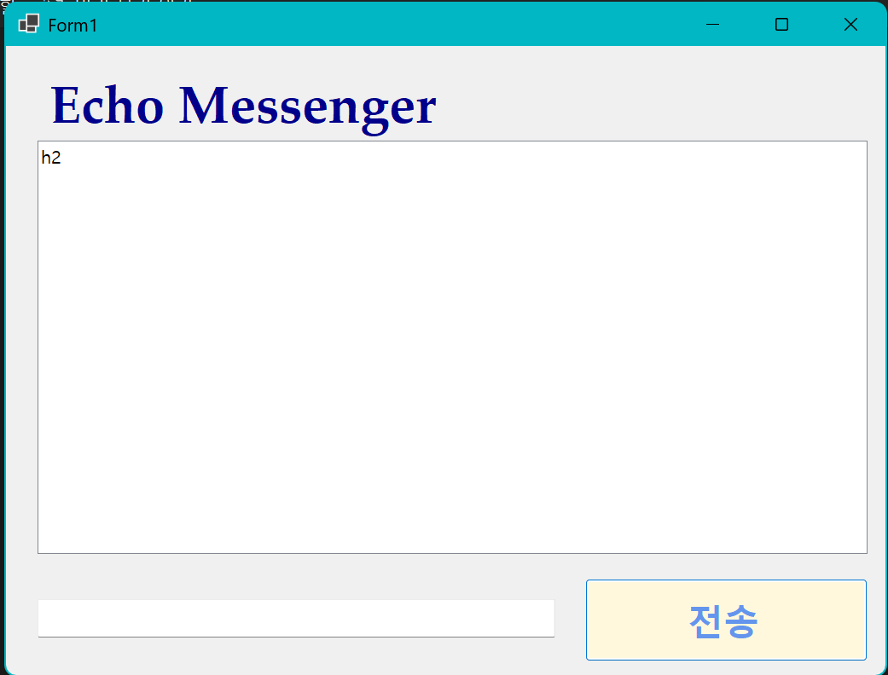

# (C# 코딩) 에코메신저

## 개요-C# 프로그래밍학습

- 1줄소개: 사용자키보드입력을받아서처리하는프로그램

- 사용한플랫폼: C#, .NET Windows Forms, Visual Studio, GitHub

- 사용한컨트롤: Label, TextBox, ListBox, Button

- 사용한기술과구현한기능:
	- Visual Studio를이용하여UI 디자인
	- string 클래스를이용한사용자입력데이터처리

- 수업중에배우고사용했던클래스들관련된설명
	- textbox로 입력을 받으면, string으로 변수에 저장한다.
	- 그 후, 입력된 내용이 빈칸이거나 공백으로 되었는지 확인 후, ListBox에 변수의 내용을 저장시킨다.

- 실습중에구현한기능들설명
	- 메시지를 입력한 후 전송 버튼을 누르면, 입력한 메시지를 리스트 박스에 띄운다.
	- 전송된 후, 입력창의 내용은 지워진다.
	- 만약 빈칸이거나 공백으로 된 메시지를 전송한다면 리스트 박스에 띄우지는 않는다.

## 실행화면(과제1)
-과제1코드의실행스크린샷

- 과제내용
	- 기본 UI 구성
	- 기본 기능 추가(전송 기능, 입력창 정리)

- -구현내용과기능설명
	- TextBox에 텍스트 입력 후 전송 버튼 누르면 입력된 내용을 LIstBox에 추가한다.
	- 이후, TextBox에 있던 내용을 삭제한다. 

## 실행화면(과제2)
-과제2코드의실행스크린샷

- 과제내용
	- 입력창에 입력 포커스 갖다 놓기
	- 엔터키로 전송하기
	- 입력 방어

- 구현내용과기능설명
	- 메시지 전송후 입력창에 다시 커서 배치
	- Enter키로도 전송할 수 있다.
	- 빈 내용이거나 공백으로 입력된 내용일 경우 내용을 ListBox에 추가 안하고 내용만 지운다.

## 실행화면(과제3)
-과제3코드의실행스크린샷

-과제내용
  -
-구현내용과기능설명
  -

## 실행화면(과제4)
-과제4코드의실행스크린샷

-과제내용
  -
-구현내용과기능설명
  -